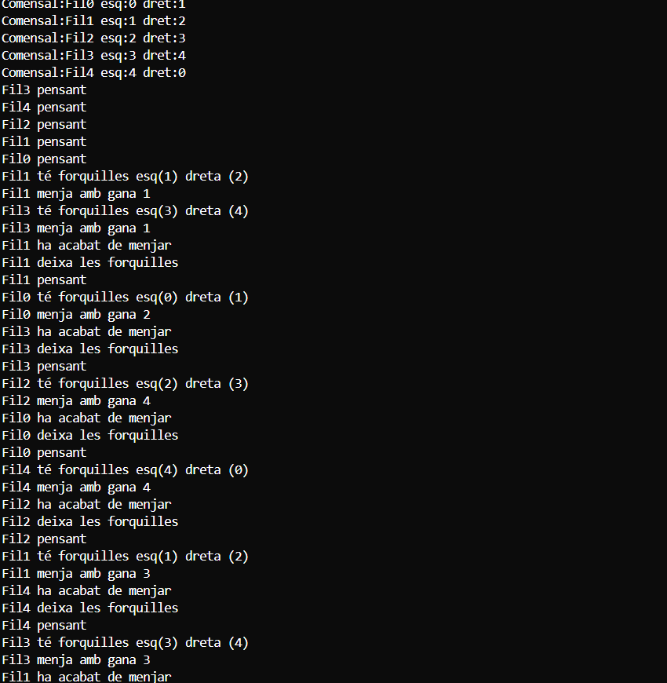

# M9-UF2
UF2: Processos y fils

# 09 - Sopar dels filòsofs (amb Lock)

## Concepte clau  
Simulem el problema dels **filòsofs que mengen i pensen**. Per menjar, necessiten dues forquilles, però aquestes són compartides, cosa que pot generar **condicions de carrera** o **deadlocks**.  

Per evitar bloquejos i garantir una sincronització correcta, utilitzem **ReentrantLock**, una classe de Java que permet exclusions mútues en recursos compartits.  

## Classes  

 **1 - Forquilla**: Conté un `ReentrantLock` per gestionar-ne l'ús exclusiu.  
 **2 - Filòsof**: Agafa dues forquilles per menjar i després les allibera.  
 **3 - Taula**: Administra filòsofs i forquilles per coordinar la simulació.

## Salida por pantalla
