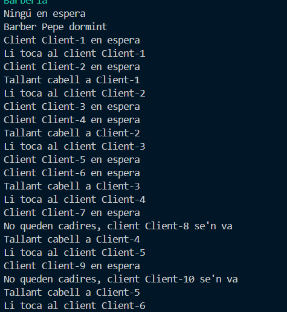

# M9-UF2
UF2: Processos y fils

# 09 - Sopar dels filòsofs (amb Lock)

## Concepte clau  
Simulem el problema dels **filòsofs que mengen i pensen**. Per menjar, necessiten dues forquilles, però aquestes són compartides, cosa que pot generar **condicions de carrera** o **deadlocks**.  

Per evitar bloquejos i garantir una sincronització correcta, utilitzem **ReentrantLock**, una classe de Java que permet exclusions mútues en recursos compartits.  

## Classes  

 **1 - Forquilla**: Conté un `ReentrantLock` per gestionar-ne l'ús exclusiu.  
 **2 - Filòsof**: Agafa dues forquilles per menjar i després les allibera.  
 **3 - Taula**: Administra filòsofs i forquilles per coordinar la simulació.

## Salida por pantalla

# 11 - El barber Mandrós

## Concepte clau  
Simulem el problema clàssic del **barber mandrós**, on un barber dorm fins que arriba un client. Si hi ha clients, els atén un per un, i quan la barberia es buida, torna a dormir. La barberia té un nombre limitat de cadires per a l'espera, i els clients que troben la barberia plena se'n van.  

Per gestionar la concurrència i la sincronització dels fils, utilitzem **synchronized** i l'objecte de sincronització `condBarber` per coordinar el barber i els clients. Això evita **condicions de carrera** i garanteix que el barber no treballi si no hi ha clients esperant.

## Classes  

 **1 - Barber**: Representa el barber, que espera clients i els talla els cabells en un temps aleatori entre 0,9s i 1s. Quan no hi ha clients, s'adorm fent `wait()`.  
 **2 - Barberia**: Administra la cua d'espera dels clients i té un límit de cadires. També coordina la interacció entre clients i el barber amb `notify()`.  
 **3 - Client**: Representa els clients que arriben a la barberia. Si hi ha lloc, s'asseuen a l'espera; si no, se'n van.  

## Salida por pantalla

